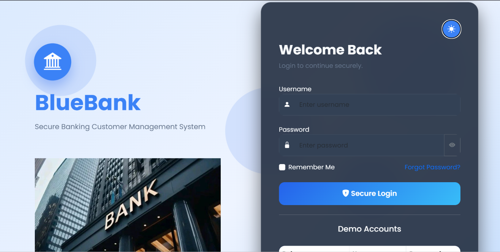
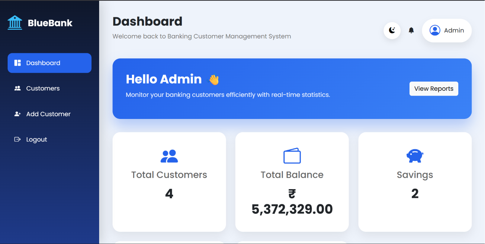
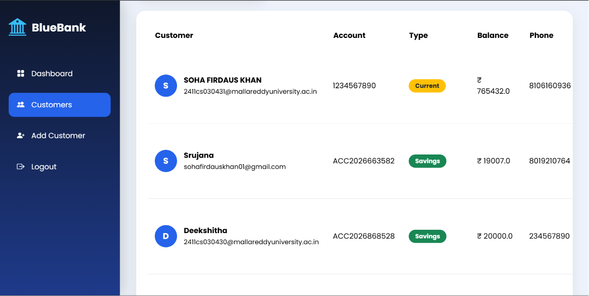
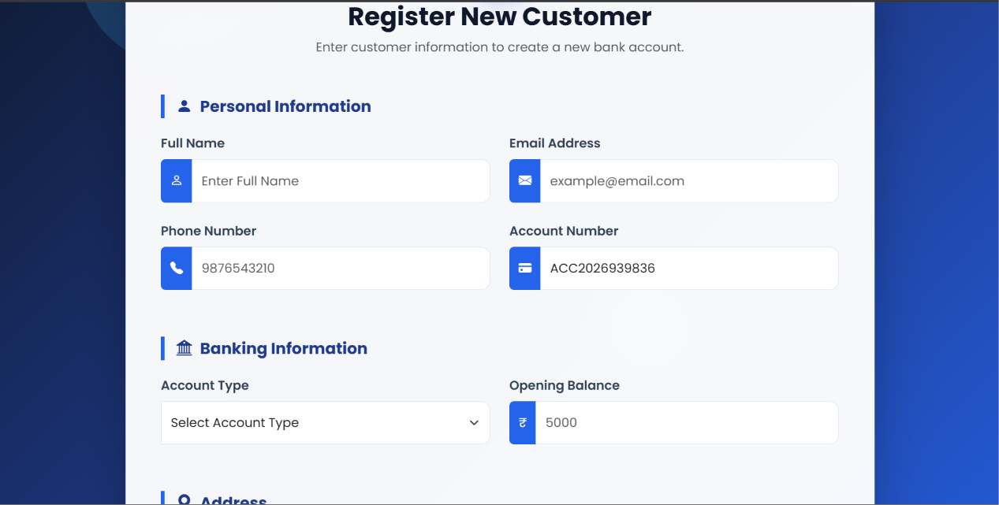
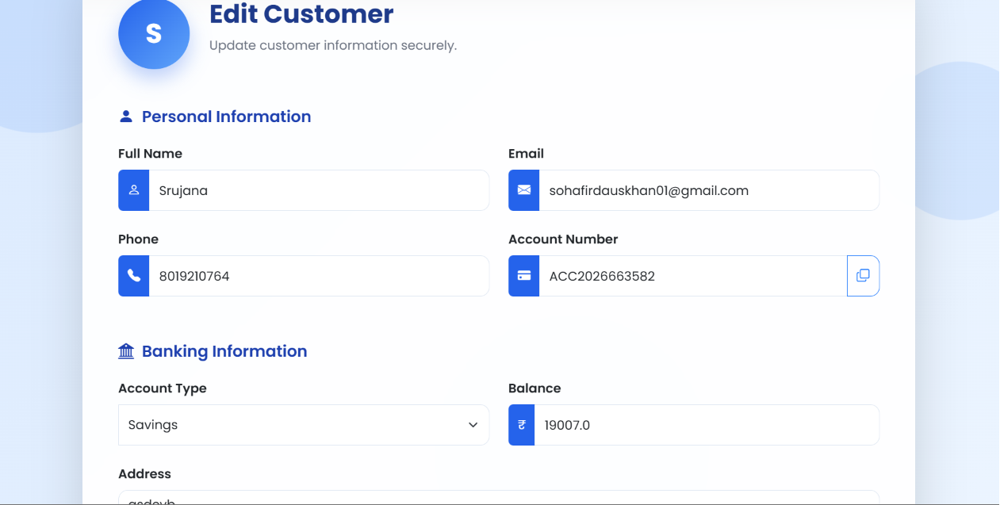

# 🏦 BlueBank - Banking Customer Management System

BlueBank is a Banking Customer Management System developed using Java Spring Boot and MySQL.

## Features

- 🔐 Secure Login Authentication
- 👤 Add Customers
- ✏️ Edit Customer Details
- 🗑 Delete Customers
- 📋 View Customer List
- 📊 Interactive Dashboard
- 📈 Customer Statistics
- 💰 Total Balance Overview
- 🎨 Modern Responsive UI

## Technologies Used

- Java
- Spring Boot
- Spring Security
- Thymeleaf
- MySQL
- Bootstrap 5
- HTML5
- CSS3
- JavaScript
- Chart.js

## Screenshots

## Login Page



---

## Dashboard



---

## Customers



---

## Add Customer



---

## Edit Customer



## Installation

1. Clone the repository

```bash
git clone https://github.com/sfkhan296/BlueBank-.git
```

2. Open in IntelliJ IDEA or VS Code

3. Configure MySQL

4. Run the project

## Author

**Soha Firdaus Khan**
